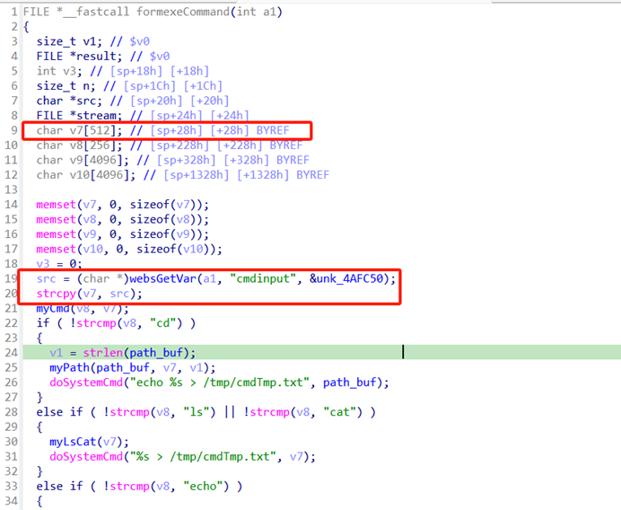
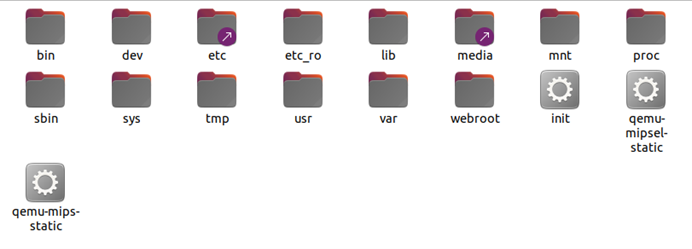
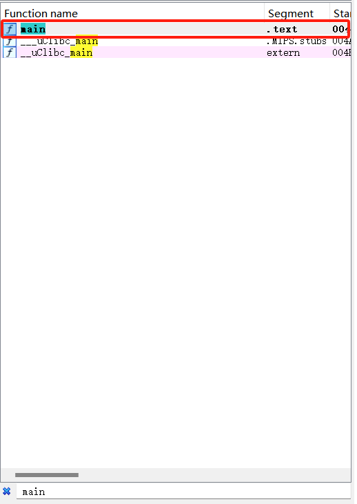
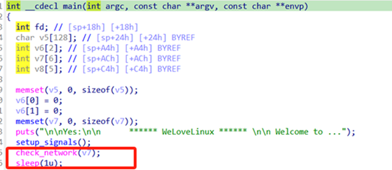
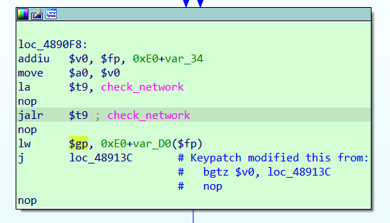
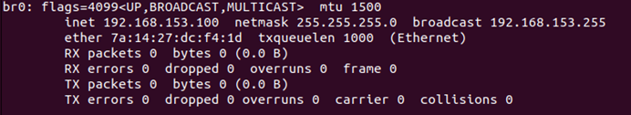
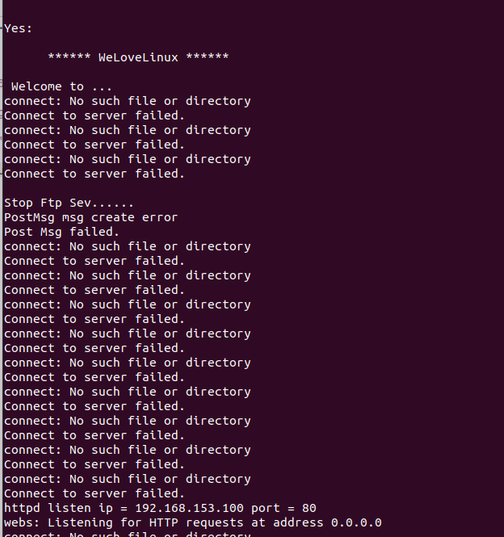
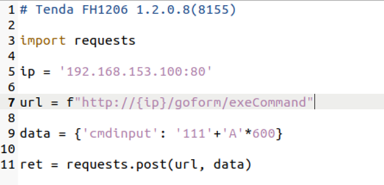
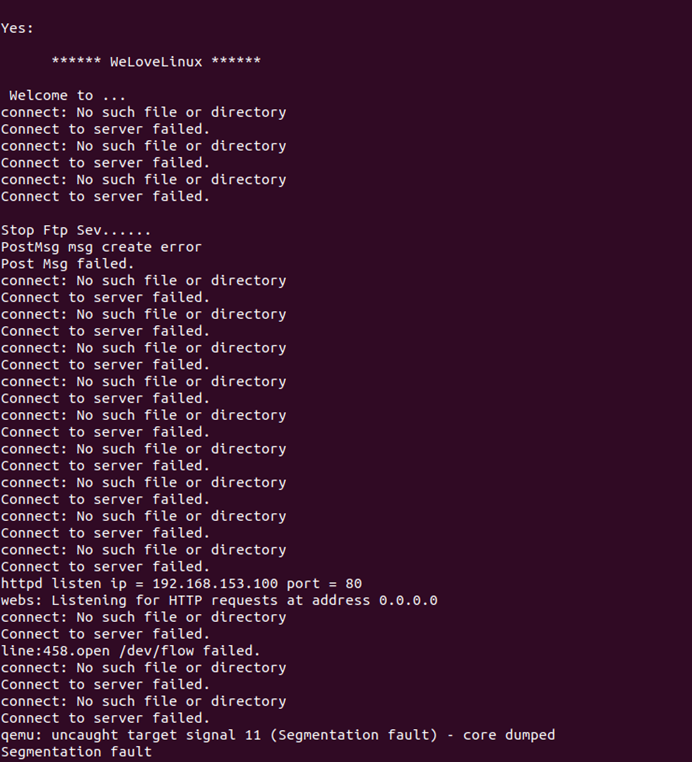

**Buffer Overflow Vulnerability in Tenda FH1206 1.2.0.8(8155)**

**Vulnerability Description:** A buffer overflow vulnerability exists in Tenda FH1206 version 1.2.0.8(8155), which originates from a failure to properly validate the length and size of user input data when calling the strcpy function in the /goform/formexeCommand file, which can be exploited by an attacker to execute arbitrary code on a system or cause a denial of service attack.

 

**Vulnerability Location:** formexeCommand function in /bin/httpd

The vulnerability is caused by the fact that the array size of v7 is fixed when defining the variable in line 9, while the src parameter is entered by the user in line 19, and the length validation of the src parameter is not done when copying src to v7 using the strcpy function in line 20.

 

**Vulnerability Replication (requires an ubuntu22 VM with qemu & binwalk installed, and IDA Pro with the mips plugin)**

1. Download the Tenda FH1203 V2.0.1.3(1079) firmware and unpack it using binwalk:

https://www.tendacn.com/hk/download/detail-2344.html

Unpacked directory:

2. Use IDA Pro to open the unpacked file: bin/httpd, Ctrl+f on the left to search for the main function, find and enter the main function, press f5 to disassemble.

3. Patch check_network(v7) on line 15 of the main function, remove the while loop (this step is to prepare for qemu emulation to run the firmware later), and the result after the patch is shown below:

The corresponding assembly code is as follows:

4. Create a virtual NIC br0 in ubuntu, the IP address can be the current same network segment, my network segment here is 192.168.153.0/24, so I set br0 ip to 192.168.153.100:

sudo brctl addbr br0

sudo ifconfig br0 192.168.153.100/24

Use the ifconfig command after successful setup to see the following display:

5. Run httpd using qemu:

sudo cp $(which qemu-mipsel-static) .

sudo chroot . ./qemu-mipsel-static ./bin/httpd

6. Construct the POC as follows and save it as poc.py:

7. Running POC in another terminal: python3 poc.py triggers a denial of service:

